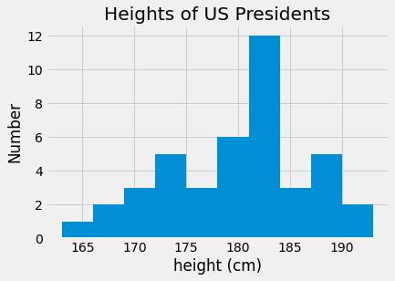
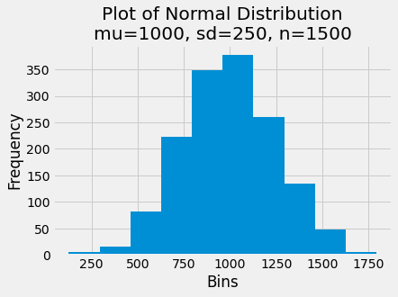

<a href="https://colab.research.google.com/github/BoomerPython/Week_3/blob/main/DSA_BoomerPython_Week3_Arrays.ipynb" target="_parent"></a>


```python
# Code for creating and manipulating arrays
# For week 3 of the BoomerPython class
import numpy as np
```

# Creating Arrays

Creating Arrays from Lists


```python
# Integer Arrays

np.array([1, 4, 2, 4, 5])

```


    array([1, 4, 2, 4, 5])


```python
# Note that Python will upcast

np.array([3.14, 4, 2, 4, 5])

```


    array([3.14, 4.  , 2.  , 4.  , 5.  ])


```python
# Or you can be specific on data type

np.array([1, 4, 2, 4, 5], dtype='int')

```


    array([1, 4, 2, 4, 5])


```python
# Or you can be specific on data type

np.array([1, 4, 2, 4, 5], dtype='float32')

```


    array([1., 4., 2., 4., 5.], dtype=float32)


```python
# But the cool part of the array is multi-dimensionality

np.array([range(i, i + 4) for i in [1, 3, 5]])
```


    array([[1, 2, 3, 4],
           [3, 4, 5, 6],
           [5, 6, 7, 8]])


Creating Arrays from Scratch


```python
# Creating a one-dimensional array of zeros
np.zeros(10, dtype=int)
```


    array([0, 0, 0, 0, 0, 0, 0, 0, 0, 0])


```python
# Creating a multi-dimensional array of zeros
np.zeros((4,5), dtype=float)
```


    array([[0., 0., 0., 0., 0.],
           [0., 0., 0., 0., 0.],
           [0., 0., 0., 0., 0.],
           [0., 0., 0., 0., 0.]])


```python
# Create an array of values evenly spaced between 0 and 1

np.linspace(0, 1, 6)
```


    array([0. , 0.2, 0.4, 0.6, 0.8, 1. ])


```python
# Create an array of random values between 0 and 1

np.random.random((4,4))
```


    array([[0.63569222, 0.11323406, 0.98894906, 0.60866802],
           [0.44880064, 0.95463614, 0.31457141, 0.72078951],
           [0.839963  , 0.48270354, 0.19727473, 0.51460842],
           [0.68425004, 0.8629233 , 0.63033323, 0.74213444]])


```python
# Create an array of normally distributed random values

np.random.normal(0, 1, (4,4))
```


    array([[-1.40850647, -0.72890327,  0.01676252, -1.17141067],
           [-0.39818411,  1.95449469,  1.53604852,  1.02485531],
           [-0.62364655, -0.00861244, -0.14301851, -0.49889883],
           [-1.37102366,  0.45953243,  0.50663861, -0.4323881 ]])


# Attributes & Indexing


```python
# one dimensional array
np.random.seed(0)
x1 = np.random.randint(10, size=5)

# two dimensional array
np.random.seed(0)
x2 = np.random.randint(10, size=(4, 5))

# three dimensional array
np.random.seed(0)
x3 = np.random.randint(10, size=(3, 4, 5))

```

Each array has the following attributes:  data type, dimension, shape, size, itemsize, and the total size in bytes of the array.


```python
print("x3 dtype:         ", x3.dtype)
print("x3 dimensions:    ", x3.ndim)
print("x3 shape:         ", x3.shape)
print("x3 size:          ", x3.size)
print("x3 element bytes: ", x3.itemsize)
print("x3 total bytes:   ", x3.nbytes)

```

    x3 dtype:          int64
    x3 dimensions:     3
    x3 shape:          (3, 4, 5)
    x3 size:           60
    x3 element bytes:  8
    x3 total bytes:    480
    

If you recall the indexing of list elements in Python, you should feel comfortable with accessing single elements in an Array


```python
x2
```


    array([[5, 0, 3, 3, 7],
           [9, 3, 5, 2, 4],
           [7, 6, 8, 8, 1],
           [6, 7, 7, 8, 1]])


```python
# First element in the array
x2[0,0]
```


    0


```python
# Last element in the array
x2[3, 4]

# Notice that the index is Row x Column
# Try:
# x3[4, 3]
```


    6


```python
# Another view of last
x2[-1, -1]
```


    6


```python
# Simple to change value of element
x2[0, 0]=28
x2
```


    array([[28,  0,  3,  3,  7],
           [ 9,  3,  5,  2,  4],
           [ 7,  6,  8,  8,  1],
           [ 6,  7,  7,  8,  1]])


```python
# And with the seed - simple to revert to original
np.random.seed(0)
x2 = np.random.randint(10, size=(4, 5))
x2
```


    array([[5, 0, 3, 3, 7],
           [9, 3, 5, 2, 4],
           [7, 6, 8, 8, 1],
           [6, 7, 7, 8, 1]])


# Slicing & Shaping

And if we can index the array, we can slice the array


```python
# Take two rows and three columns from x2

x2[:2, :3]
```


    array([[5, 0, 3],
           [9, 3, 5]])


```python
# Take three rows and two columns from x2
x2[:3, :2]
```


    array([[5, 0],
           [9, 3],
           [7, 6]])


```python
# Take all rows but every other column
# Remember the syntax is array[start:stop:step]

x2[:4, ::2]
```


    array([[5, 3, 7],
           [9, 5, 4],
           [7, 8, 1],
           [6, 7, 1]])


```python
# And we can even reverse the entire array

x2[::-1, ::-1]
```


    array([[1, 8, 7, 7, 6],
           [1, 8, 8, 6, 7],
           [4, 2, 5, 3, 9],
           [7, 3, 3, 0, 5]])


```python
# We can also reshape from a list of 9 values to a 3 by 3 grid
grid = np.arange(1,10).reshape(3,3)
print(grid)
```

    [[1 2 3]
     [4 5 6]
     [7 8 9]]
    

# Universal Functions


```python
# Computation on arrays can be fast or slow - the key is using Numpy's universal
# functions to use vectorized operations
# Let's imagine we have a large array and want to calculate the reciprocal of 
# each element 
```


```python
np.random.seed(0)

def compute_reciprocals(values):
    output = np.empty(len(values))
    for i in range(len(values)):
      output[i] = 1.0 / values[i]
    return output

values = np.random.randint(1, 10, size = 5)
compute_reciprocals(values)
```


    array([0.16666667, 1.        , 0.25      , 0.25      , 0.125     ])


The above function accepts some values and then calculates the reciprocal of each element.  While it seems quick - remember - the array only has five elements - what happens with a larger array?


```python
np.random.seed(0)
big_array = np.random.randint(1, 100, size = 10000000)
%timeit compute_reciprocals(big_array)
```

    1 loop, best of 5: 23.1 s per loop
    

Whoa - that is a long time (your runtime might vary) - lets examine how we can force python to use the compiled layer of numpy for faster execution.


```python
# Just to make sure we get the same results

print(compute_reciprocals(values))
print(1.0 / values)
```

    [0.16666667 1.         0.25       0.25       0.125     ]
    [0.16666667 1.         0.25       0.25       0.125     ]
    


```python
# Now lets look at runtime for the big array

%timeit (1.0 / big_array)
```

    10 loops, best of 5: 18.4 ms per loop
    

That is a lot faster - but what else can we do?  Basically math :)


```python
x = np.arange(5)
print("x =     ", x)
print("x + 5 = ", x + 5)
print("x - 5 = ", x - 5)
print("x * 2 = ", x * 2)
print("x / 2 = ", x / 2)

```

    x =  [0 1 2 3 4]
    x + 5 =  [5 6 7 8 9]
    x - 5 =  [-5 -4 -3 -2 -1]
    x * 2 =  [0 2 4 6 8]
    x / 2 =  [0.  0.5 1.  1.5 2. ]
    


```python
# And for those of you wanting more?
# % is the modulus
# ** exponent

print("-x =     ", -x)
print("x % 2 =  ", x % 2)
print("x ** 2 = ", x * 2)
```

    -x =      [ 0 -1 -2 -3 -4]
    x % 2 =   [0 1 0 1 0]
    x ** 2 =  [0 2 4 6 8]
    

# Aggregations


```python
# Python has a built in function for summing an object
sum(grid)
```


    array([12, 15, 18])


```python
# As you can see - the default sum calculates the sum of each column 
# in the array
# For calculating the sum of the array we want np.sum()

np.sum(grid)
```


    45


```python
# The min and max functions work similarly

np.min(grid), np.max(grid)
```


    (1, 9)


# Example - average height


```python
# The following example moves us closer to an analytical problem
# We will use Pandas to read in the data but will use array functions
# to explore the data

import pandas as pd
data = pd.read_csv("https://raw.githubusercontent.com/BoomerPython/Week_3/main/president_heights.csv")
heights = np.array(data['height(cm)'])
print(heights)
```

    [189 170 189 163 183 171 185 168 173 183 173 173 175 178 183 193 178 173
     174 183 183 168 170 178 182 180 183 178 182 188 175 179 183 193 182 183
     177 185 188 188 182 185]
    


```python
# Summary statistics are easy

print("Mean height:             ", heights.mean())
print("Standard Deviation:      ", heights.std())
print("Minimum height:          ", heights.min())
print("Maximum height:          ", heights.max())

```

    Mean height:              179.73809523809524
    Standard Deviation:       6.931843442745892
    Minimum height:           163
    Maximum height:           193
    


```python
# Quartiles are also easy

print("25th percentile:   ", np.percentile(heights, 25))
print("Median:            ", np.median(heights))
print("75th percentile:   ", np.percentile(heights, 75))

```

    25th percentile:    174.25
    Median:             182.0
    75th percentile:    183.0
    


```python
# Plots are easy - more on that Week 4

import matplotlib.pyplot as plt
import matplotlib.style as style

style.use('fivethirtyeight')

plt.hist(heights)
plt.title('Heights of US Presidents')
plt.xlabel('height (cm)')
plt.ylabel('Number');
```


    

    


```python
# Normally distributed (mean = 1000, sd = 250, n = 1500)
data = np.random.normal(1000, 250, 1500)

# Create the plot
plt.hist(data)
plt.title('Plot of Normal Distribution\nmu=1000, sd=250, n=1500')
plt.xlabel('Bins')
plt.ylabel('Frequency');
```


    

    


```python

```
