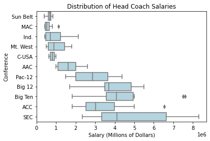

# Homework 2 - Modeling Coaches Salaries
*Author: Daniel Carpenter*

---

## Purpose of File:

Import Football datasets to predict:
- recommended salary for the OU football coach
- appropriate salary be if OU moved to the SEC
- single biggest impact on salary size

## Import some common packages


```python
import pandas  as pd
import numpy   as np
import seaborn as sns # Plots
```

## Import data from https://github.com/BoomerPython/data
*Data automatically in form of data frame when using `pandas`*


```python
# Data for the coaches dataset
Coaches = pd.read_csv('https://raw.githubusercontent.com/BoomerPython/data/main/coaches_bp_dsa.csv')

# Data for the Stadiums dataset
Stadiums = pd.read_csv('https://raw.githubusercontent.com/BoomerPython/data/main/stadium_bp_dsa.csv')

# Data for the Team Statistics dataset
TeamStats = pd.read_csv('https://raw.githubusercontent.com/BoomerPython/data/main/stats_bp_dsa.csv')
```

## Build a data frame for your analysis incuding data pulled in above
1. Join the three above datasets together on the identifiers `School` and `Conf`
2. Drop null values in dataset (see description in line comments)
3. Trim and clean data (strings to float, etc.)


```python
# Left Join dataframs: Coaches to Stadiums 
df = pd.merge(Coaches, Stadiums, 
              on = ['School', 'Conf'], # Keys to join to
              how = 'left')            # Left join

# Left Join above df to TeamStats
df = pd.merge(df, TeamStats, 
              on = ['School', 'Conf'], # Keys to join to
              how = 'left')            # Left join

# Drop null values from dataset since will not work with model ----------------

## Create a copy of the schools before removing the NAs
allSchools = df[:]

## Drop the schools with NAs
colsDropped = df.isna().sum()
print('\nSummary of NA values present by column in data frame:', colsDropped)
df = df.dropna()

## Capture a copy of a list of the removed schools
removedSchools = allSchools[~allSchools['School'].isin(df['School'])]['School'].unique()


# Trim the column names and rename some for coding ease -----------------------
## Note there was whitespace in the column names
df = df.rename(columns=lambda x: x.strip())
df = df.rename(columns = {'Graduation Rate (GSR)': 'GradRate',
                          'Defense Score':         'DefenseScore',
                          'OffenceScore':          'OffenseScore',
                          'W':                     'WinRecord',
                          'L':                     'LossRecord',
                          'Ratio':                 'WinLossRatio',
                          'Conf':                  'Conference'})

## View the changes
print('\n', df.columns)


# Convert Non-Numeric Columns to Numeric that should be -----------------------

## Trim out whitespace
df['TotalPay'] = df['TotalPay'].str.strip()
df['StadSize'] = df['StadSize'].str.strip()

## Stadium size: Convert to type float
df['StadSize'] = df['StadSize'].str.replace(',', '').astype(float)

## Total Pay of coach: Convert to type float
### First remove commas 
df['TotalPay'] = df['TotalPay'].str.replace(',', '')

### Remove $ signs and convert to number
df['TotalPay'] =  pd.to_numeric(df['TotalPay'].str.replace('$', '').astype(float),
                                errors = 'coerce')

### View changes
print('\n', df.head())
```

    
    Summary of NA values present by column in data frame: School                      0
    Conf                        0
    Coach                       0
     TotalPay                   5
     Graduation Rate (GSR)      0
     StadSize                   0
    W                          11
    L                          11
     Ratio                     11
    OffenceScore               11
    Defense Score              11
    Score                      11
    PointsPerGame              11
    dtype: int64
    
     Index(['School', 'Conference', 'Coach', 'TotalPay', 'GradRate', 'StadSize',
           'WinRecord', 'LossRecord', 'WinLossRatio', 'OffenseScore',
           'DefenseScore', 'Score', 'PointsPerGame'],
          dtype='object')
    
                   School Conference              Coach   TotalPay  GradRate  \
    0          Air Force   Mt. West       Troy Calhoun   885000.0        83   
    1              Akron        MAC       Terry Bowden   412500.0        45   
    2            Alabama        SEC         Nick Saban  8307000.0        79   
    3  Appalachian State   Sun Belt  Scott Satterfield   712500.0        57   
    4            Arizona     Pac-12       Kevin Sumlin  2000000.0        74   
    
       StadSize  WinRecord  LossRecord  WinLossRatio  OffenseScore  DefenseScore  \
    0   46692.0       10.0         3.0      3.333333          4.96         -0.87   
    1   30000.0        5.0         7.0      0.714286         -0.40         -6.12   
    2  101821.0       14.0         1.0     14.000000          8.01         17.62   
    3   24050.0       10.0         3.0      3.333333         -0.86          9.68   
    4   51811.0        3.0         9.0      0.333333          1.01         -5.64   
    
       Score  PointsPerGame  
    0   4.09          78.16  
    1  -6.52          72.64  
    2  25.62          90.38  
    3   8.83          70.76  
    4  -4.63          74.42  
    

    C:\Users\DANIEL~1.CAR\AppData\Local\Temp/ipykernel_38544/2983478437.py:55: FutureWarning: The default value of regex will change from True to False in a future version. In addition, single character regular expressions will *not* be treated as literal strings when regex=True.
      df['TotalPay'] =  pd.to_numeric(df['TotalPay'].str.replace('$', '').astype(float),
    

## Conduct an initial data analysis - develop appropriate visualizations

### Pairs plots (Overview)
* [Click link to see recources](https://seaborn.pydata.org/generated/seaborn.pairplot.html)


```python
## Initial Look to see how variables correlate with pay -----------------------
allConfs = sns.pairplot(df, y_vars=['TotalPay'], 
                        kind="reg", # add Regression line
                        plot_kws={'line_kws':{'color':'orange'}} 
                        )

allConfs.fig.suptitle('Pair Plot of all Conferences. Note Stadium Size and Score')
```


    Text(0.5, 0.98, 'Pair Plot of all Conferences. Note Stadium Size and Score')


    

    


### Pairs plots (By Conference)

Analysis:
* Most larger conferences follow slightly similar trend to the overall dataset
* Would be wary of analyzing changes to a smaller conference since such limited number of samples
* Should be fine to create a model with all conferences and/or bigger conferences


```python
## Does the conference have anything to do? -----------------------------------

### Get Unique list of conferences to iterate over
uniqueConferences = df['Conference'].unique()

### Plot each conference to see if each conference holds to overall trends
for conference in uniqueConferences:
    
    # Filter dataframe to conference
    df_tempConf = df[df['Conference'] == conference]
    
    # Pair plot of JUST the conference
    thePlot = sns.pairplot(df_tempConf, 
                           kind="reg", # add Regression line
                           plot_kws={'line_kws':{'color':'gray'}},
                           y_vars=['TotalPay']
                           )

    # Add some titles
    thePlot.fig.suptitle("Conference Name: " + conference + " | Schools in Conf.: " + str(len(df_tempConf['School'])))

```


    

    


    

    


    

    


    

    


    

    


    

    


    

    


    

    


    

    


    

    


    

    


### See the distribution of salaries

#### Distribution Overview
* Median around $2MM in salary
* High spread so would like to see if any categorical reasoning for that, such as spread amongst conferences.


```python
import matplotlib.pyplot as plt # for plots

## Create the figure
fig, axs = plt.subplots(2, 1, constrained_layout=False)

## The title of the figure
fig.suptitle("Distribution of Head Coach Salaries")

## A histogram of salaries
axs[0].hist(df['TotalPay'], density = False, stacked = False, rwidth = .8)
axs[0].set_ylabel('Number of Schools')

## A boxplot of salaries
axs[1].boxplot(df['TotalPay'], vert=False)
axs[1].set_xlabel('Salary (Millions of Dollars)')
axs[1].set_ylabel('Number of Schools')

plt.show()
```


    

    


#### Distribution of Salary by Conference
* Conferences seem to exhibit disparities in salary pay
* Wide spread distribution in SEC


```python
# Boxplot by conference -------------------------------------------------------
bplots = sns.boxplot(y="Conference", x="TotalPay", color = "lightblue",
                     data=df.sort_values(by="TotalPay"))
bplots.set_title('Distribution of Head Coach Salaries')
bplots.set_xlabel('Salary (Millions of Dollars)')
```


    Text(0.5, 0, 'Salary (Millions of Dollars)')


    

    


## Fit a regression model with the salary as the response variable
* Note Did not include `LossRecord` or `WinLossRatio` since multicolinearity with `WinRatio`
* Note Did not include `Score` since potential colinearity with `Points` per game


```python
import statsmodels.formula.api as smf # Linear regression package

# Create the model
# Note Did not include LossRecord or WinLossRatio since multicolinearity
# Note Did not include Score since potential colinearity with Points per game
model = smf.ols(formula='TotalPay ~ Conference + GradRate + StadSize + WinRecord + OffenseScore + DefenseScore + PointsPerGame',
                data=df)

# The estimation using OLS - tried GLM but similar results
est = model.fit()

# Show the fitted model
print(est.summary())

# Get the coefficients
coefsRaw = est.params      # As series
coefs = np.array(coefsRaw) # AS np array
```

                                OLS Regression Results                            
    ==============================================================================
    Dep. Variable:               TotalPay   R-squared:                       0.837
    Model:                            OLS   Adj. R-squared:                  0.807
    Method:                 Least Squares   F-statistic:                     27.67
    Date:                Fri, 10 Jun 2022   Prob (F-statistic):           3.62e-27
    Time:                        16:36:07   Log-Likelihood:                -1543.7
    No. Observations:                 103   AIC:                             3121.
    Df Residuals:                      86   BIC:                             3166.
    Df Model:                          16                                         
    Covariance Type:            nonrobust                                         
    ==========================================================================================
                                 coef    std err          t      P>|t|      [0.025      0.975]
    ------------------------------------------------------------------------------------------
    Intercept              -7.233e+06   3.24e+06     -2.232      0.028   -1.37e+07   -7.91e+05
    Conference[T.ACC]       9.705e+05   4.19e+05      2.317      0.023    1.38e+05     1.8e+06
    Conference[T.Big 12]    1.563e+06   4.48e+05      3.490      0.001    6.73e+05    2.45e+06
    Conference[T.Big Ten]   1.419e+06   4.53e+05      3.133      0.002    5.19e+05    2.32e+06
    Conference[T.C-USA]     6.911e+05   6.95e+05      0.995      0.323    -6.9e+05    2.07e+06
    Conference[T.Ind.]     -7.683e+05   5.34e+05     -1.439      0.154   -1.83e+06    2.93e+05
    Conference[T.MAC]      -2.022e+05   4.17e+05     -0.484      0.629   -1.03e+06    6.28e+05
    Conference[T.Mt. West] -2.421e+05   4.11e+05     -0.589      0.557   -1.06e+06    5.74e+05
    Conference[T.Pac-12]    7.635e+05   4.84e+05      1.578      0.118   -1.98e+05    1.73e+06
    Conference[T.SEC]       1.551e+06   4.72e+05      3.287      0.001    6.13e+05    2.49e+06
    Conference[T.Sun Belt] -1.382e+05   4.45e+05     -0.310      0.757   -1.02e+06    7.47e+05
    GradRate                4485.0785   6350.727      0.706      0.482   -8139.749    1.71e+04
    StadSize                  29.3014      6.241      4.695      0.000      16.895      41.707
    WinRecord              -6844.7775   8.35e+04     -0.082      0.935   -1.73e+05    1.59e+05
    OffenseScore           -7.405e+04   5.98e+04     -1.239      0.219   -1.93e+05    4.48e+04
    DefenseScore            6.425e+04   3.58e+04      1.796      0.076   -6859.210    1.35e+05
    PointsPerGame           9.695e+04   4.07e+04      2.380      0.020     1.6e+04    1.78e+05
    ==============================================================================
    Omnibus:                        3.487   Durbin-Watson:                   1.786
    Prob(Omnibus):                  0.175   Jarque-Bera (JB):                3.053
    Skew:                          -0.256   Prob(JB):                        0.217
    Kurtosis:                       3.671   Cond. No.                     2.26e+06
    ==============================================================================
    
    Notes:
    [1] Standard Errors assume that the covariance matrix of the errors is correctly specified.
    [2] The condition number is large, 2.26e+06. This might indicate that there are
    strong multicollinearity or other numerical problems.
    

## What is the recommended salary for the OU football coach?

### First create a function to:
* compare salary of a given school to its estimated salary based on data
* also perform what if analysis with the conference. E.g. move a coach to another conf.


```python
# Create a function to compare salary of a given school to its estimated salary based on data
# Also can perform what if analysis with the conference. E.g. move a coach to another conf.
def estimateCoachSalary(chosenSchool,    # The school to see check estiamted salary of
                        whatIfConference # Can change the conference to see if salary changes
                        ):

    # Filter to the chosen school
    school_Stats = df.query("School == @chosenSchool")
    
    # Input paramaters of the school
    school_Conference    = 'Conference[T.' + whatIfConference +']'
    school_Coach         = str(np.array(school_Stats['Coach'])[0])
    school_TotalPay      = float(school_Stats['TotalPay'])
    school_GradRate      = float(school_Stats['GradRate'])
    school_StadSize      = float(school_Stats['StadSize'])
    school_WinRecord     = float(school_Stats['WinRecord'])
    school_OffenseScore  = float(school_Stats['OffenseScore'])
    school_DefenseScore  = float(school_Stats['DefenseScore'])
    school_PointsPerGame = float(school_Stats['PointsPerGame'])
    
    # Input paramaters of the school in list
    school_Params = [1, 1, # To indicate intercept and conference
                     school_GradRate, school_StadSize,  school_WinRecord, 
                     school_OffenseScore,  school_DefenseScore, school_PointsPerGame]
    
    
    tailoredCoefs = [] # To hold a list of tailored coefficients
    
    for variable in range(len(coefsRaw)):
    
        indexName     = coefsRaw.index[variable]    
        variableToAdd = coefs[variable]
    
        # Only add if in the right conference
        if not (indexName.startswith("Conference") and not indexName == school_Conference):
            tailoredCoefs.append(variableToAdd)
    
    
    # Now calculate the expected salary by doing matrix multipication
    estSalary = np.dot(np.array(tailoredCoefs), np.array(school_Params))
    
    # Summary of if overpaid
    isOverpaid = estSalary < school_TotalPay
    if isOverpaid: paidOverUnder = 'overpaid' 
    else: paidOverUnder = 'underpaid'
    
    # Summary of salary
    print('\nThe estimated (modeled) salary of', chosenSchool, 'in the', whatIfConference,
          'is $', '{:,.2f}'.format(estSalary),
          '\nCurrently,', chosenSchool, 'pays $', '{:,.0f}'.format(school_TotalPay),
          '\n Therfore,', school_Coach, 'is', paidOverUnder)
    
    # Return the estimated salary
    return estSalary
```

### Now estimate OU Salary
* See below for automated results


```python
# Check the estimated salary of Oklahoma coach 
estimateCoachSalary(chosenSchool = 'Oklahoma',
                    whatIfConference = 'Big 12')
```

    
    The estimated (modeled) salary of Oklahoma in the Big 12 is $ 4,902,342.82 
    Currently, Oklahoma pays $ 4,800,000 
     Therfore, Lincoln Riley is underpaid
    


    4902342.821037227


## What would the appropriate salary be if OU moved to the SEC?
* See below for automated results


```python
# Change the conference of OU to the SEC
estimateCoachSalary(chosenSchool = 'Oklahoma',
                    whatIfConference = 'SEC')
```

    
    The estimated (modeled) salary of Oklahoma in the SEC is $ 4,890,450.47 
    Currently, Oklahoma pays $ 4,800,000 
     Therfore, Lincoln Riley is underpaid
    


    4890450.473216997


## What schools did we drop from our data and why?
* See below for automated results
* Below shows the schools dropped from the sample 
* The schools contain null values which would cause issues with modeling


```python
print('\nBelow shows the schools dropped from the sample since there were null values:\n',
      removedSchools)
```

    
    Below shows the schools dropped from the sample since there were null values:
     ['Baylor' 'Bowling Green' 'Brigham Young' 'Central Florida'
     'Coastal Carolina' 'Liberty' 'Louisiana-Lafayette' 'Miami (Fla.)'
     'Miami (Ohio)' 'Mississippi' 'Pittsburgh' 'Southern California'
     'Southern Methodist' 'Temple' 'Tennessee']
    

## What is the single biggest impact on salary size?
* See below for automated results
* Note that big 12 coefficient has a statistically signifcant t-value
* Model also has very high R squared, indicating that most of the variation in the independant variables explain the dependant variable.


```python
# Get the most impactful parameter (max) - note not best fit, highest value
maxValue         = max(coefs)                  # The coefficient of the most impactful
idxOfMaxValue    = np.where(coefs == maxValue) # The idx of the max value
mostImpactfulVar = coefsRaw.index[idxOfMaxValue]     # The most impactful variable and value

print('\nThe most impactful variable is:', mostImpactfulVar[0], 
      '\nI.e., being in the', mostImpactfulVar[0], 
      'correlates with an increase in salary of $', '{:,.2f}'.format(maxValue),
      '\nPlease not that this does not consider the statistical significance.')
```

    
    The most impactful variable is: Conference[T.Big 12] 
    I.e., being in the Conference[T.Big 12] correlates with an increase in salary of $ 1,563,196.39 
    Please not that this does not consider the statistical significance.
    
